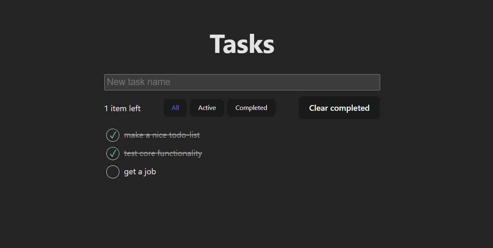

# Todo-list (React, TypeScript)



## Инструменты:

- Сборка: [Vite](https://vitejs.dev/)
- UI: React
- State management: `useReducer()` + `localStorage`
- CSS: [CSS Modules](https://github.com/css-modules/css-modules)
- Тесты:
  - [Vitest](https://vitest.dev/)
  - [react-testing-library](https://testing-library.com/)

## Что интересного

- Стейт-менеджемент: компактный хук `useLocalStorage()` даёт главному компоненту `state` и `dispatch`, и сохраняет все изменения в `localStorage`

## Установка

1. Клонировать репозиторий (или скачать ZIP):

```
git clone https://github.com/branxy/tested-todo-list.git
```

2. Перейти в проект:

```
cd tested-todo-list
```

3. Установить зависимости

```
npm i
```

4. Запуск (любая команда ниже):

```
npm start
npm run start
npm run dev
```

5. Запуск тестов:

- В отдельной вкладке браузера:

```
npm run test:ui
```

- Только в терминале:

```
npm test
```
